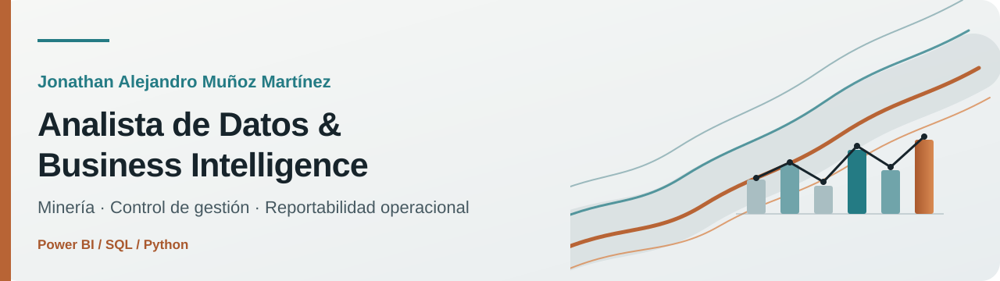

<picture>
  <source media="(prefers-color-scheme: dark)" srcset="./assets/profile-banner-dark.svg">
  <source media="(prefers-color-scheme: light)" srcset="./assets/profile-banner-light.svg">
  
</picture>

## Datos que conectan la operación con la decisión

Transformo datos operacionales, planillas de faena y fuentes públicas en **modelos trazables, indicadores de gestión y productos de Business Intelligence**.

Mi experiencia combina cerca de cinco años en proyectos mineros de gran escala —**QB2 (Teck / Bechtel, EPCM)** y **C20+ (Collahuasi)**— con Power BI, SQL y Python. El objetivo no es solo reportar: es entregar información que permita detectar desviaciones, anticipar necesidades y tomar decisiones con evidencia.

[LinkedIn](https://www.linkedin.com/in/munozmartinezja) · [Correo](mailto:munozmartinez.ja@gmail.com) · [Proyectos](#proyectos-destacados)

## Qué aporto

- **Conocimiento operacional:** entiendo el dato desde su origen en terreno hasta su uso por el mandante.
- **Business Intelligence:** diseño modelos, KPIs y tableros orientados a control de gestión.
- **Ingeniería de datos aplicada:** automatizo ingestas, validaciones y transformaciones reproducibles.
- **Trazabilidad:** documento fuentes, supuestos y controles para que cada cifra pueda explicarse.

## Proyectos destacados

### [Copper Market Data Pipeline](https://github.com/munozmartinezja/copper-market-data-pipeline)

Pipeline en producción para ingerir y validar precios del cobre y empresas del sector. Registra la calidad de cada corrida, evita duplicidades y entrega los datos mediante dashboard y API REST.

`Python` · `Django` · `PostgreSQL` · `pandas` · `GitHub Actions` · `pytest`

[Ver repositorio](https://github.com/munozmartinezja/copper-market-data-pipeline) · [Abrir demo](https://copper-market-data-pipeline.onrender.com/)

### [Chile Mining Investment Pipeline](https://github.com/munozmartinezja/chile-mining-investment-pipeline)

Convierte la cartera de inversión minera de Cochilco y los expedientes del SEA en un conjunto de datos reproducible. Permite estudiar proyectos previstos para 2025–2034, sus estados ambientales y sus tiempos de tramitación.

`Python` · `SQL` · `DuckDB` · `análisis de supervivencia` · `Power BI`

[Ver repositorio](https://github.com/munozmartinezja/chile-mining-investment-pipeline)

## Competencias

| Área | Herramientas y capacidades |
| --- | --- |
| Business Intelligence | Power BI · Power Query · Modelado dimensional · DAX · Diseño de KPIs |
| Datos | SQL · PostgreSQL · Python · pandas · ETL · Calidad y trazabilidad |
| Gestión | Control de gestión · Reportabilidad a mandante · Análisis operacional · Excel avanzado |
| Desarrollo | Git · GitHub Actions · APIs REST · Pruebas automatizadas · Documentación técnica |

## Contexto profesional

He trabajado del lado contratista en proyectos mineros de gran escala, integrando información proveniente de sistemas de terceros, planillas operacionales y registros de terreno. Esa experiencia me permite combinar el lenguaje de la operación con el análisis de datos y comunicar resultados a audiencias técnicas y de gestión.

## Formación continua

- Microsoft Azure Data Fundamentals — **DP-900**
- Microsoft Power BI Data Analyst — **PL-300, en preparación**
- Metodología analítica — **CRISP-DM**

---

Si buscas convertir datos operacionales en decisiones claras y trazables, conversemos en [LinkedIn](https://www.linkedin.com/in/munozmartinezja) o por [correo](mailto:munozmartinez.ja@gmail.com).
